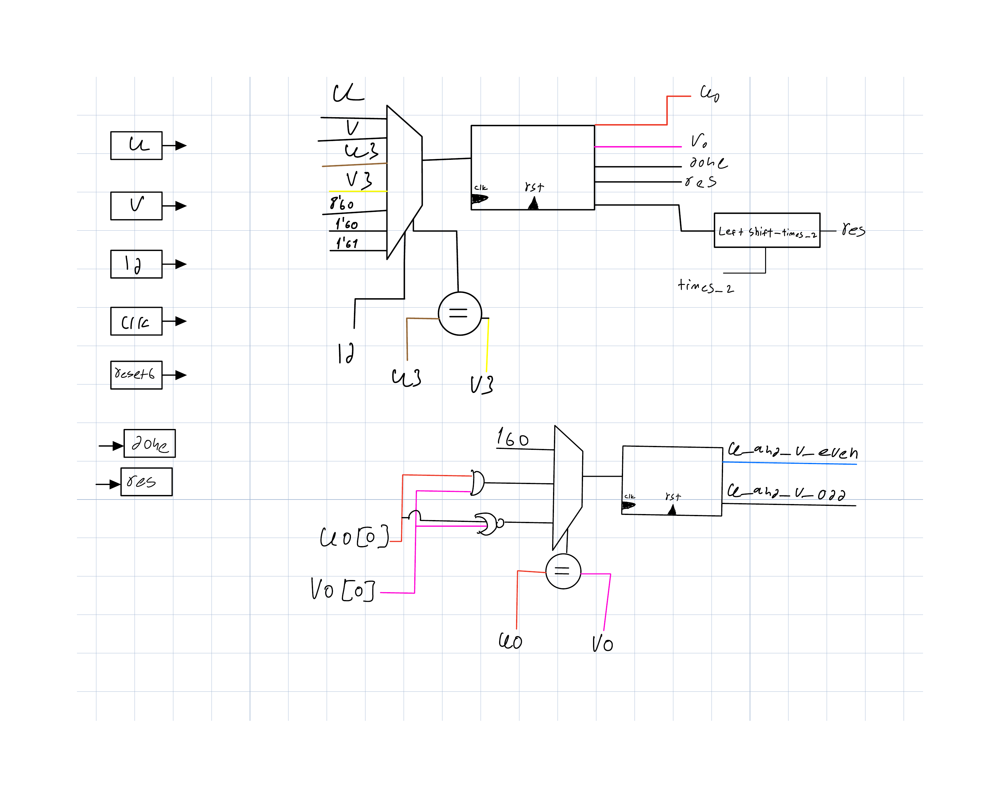

# Binary GCD Algorithm in SystemVerilog

This repository contains an implementation of the **Greatest Common Divisor (GCD)** algorithm using the **binary method**, fully written in SystemVerilog.

## 📂 Files

- `gcd.sv` – The RTL module that computes the GCD of two 8-bit unsigned integers `u` and `v`, using the binary GCD algorithm.
- `sin_gen_tb.sv` – A testbench that generates random inputs and verifies correctness against a golden model implementation.

> 🔄 The Binary GCD method is more hardware-efficient than traditional division-based GCD and is well suited for FPGA/ASIC design.

---

## ⚙️ What the module does

- Accepts two 8-bit **positive integers** (`u`, `v`) on a pulse signal `ld`.
- Computes the GCD using shifts and subtraction:
  - If both numbers are even → divide both by 2 and increase counter.
  - If one is even → divide it by 2.
  - If both are odd → subtract the smaller from the larger.
- After completion, the result is output on `res[7:0]`, and `done` is asserted.
- The output is:
  \[
  res = 	ext{gcd}(u, v) = u \cdot 2^k
  \]
  where `k` is the number of times both were divided by 2.

---
## 📊 GCD Algorithm Diagram

This flowchart illustrates the binary GCD algorithm implemented in this project:




## 🧪 Testbench Highlights

- Generates **100 random input pairs**
- For each pair:
  - Computes reference GCD using a software model (Euclidean method)
  - Compares to the output of the `gcd` module
  - Prints: `GCD(u, v) = result` or error if mismatch
- Provides good **validation coverage** for many edge cases

---

## 🧠 Skills Demonstrated

- FSM-based hardware algorithm implementation
- Binary GCD logic (bitwise operations)
- Use of control states (IDLE, LOAD, CALC, DONE)
- Multi-cycle computation logic
- Testbench with randomized verification and golden model

---

## 🧰 How to Run

If using VCS or other simulator:

```bash
vlog gcd.sv sin_gen_tb.sv
vsim work.sin_gen_tb
```

---

This GCD design is ideal for showcasing algorithmic hardware understanding and can be used in your portfolio for digital/FPGA/Embedded positions.
